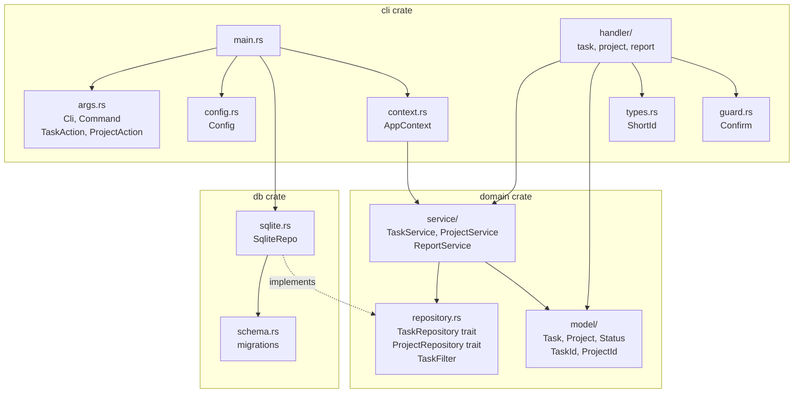

# tt - Technical Specification

## Overview

`tt` is a task tracker designed to generate formatted daily standup reports. Tasks support up to 4 levels of nesting.

---

## Data Model

### Project

| Field        | Type     | Description                                                    |
| ------------ | -------- | -------------------------------------------------------------- |
| `id`         | UUID     | Primary key                                                    |
| `slug`       | TEXT     | Unique short identifier used in CLI (e.g. `work`)              |
| `title`      | TEXT     | Optional display title (e.g. `Work Projects`)                  |
| `github_url` | TEXT     | Optional GitHub repository URL (e.g. `https://github.com/o/r`) |
| `created_at` | DATETIME | Creation timestamp                                             |

`slug` is the primary identifier in all CLI commands. `title` is shown in listings but never typed. `github_url` is used to build clickable PR links in terminal output. Projects must be created explicitly before adding tasks. All tasks belong to exactly one project.

### Task

| Field          | Type     | Description                                                      |
| -------------- | -------- | ---------------------------------------------------------------- |
| `id`           | UUID     | Primary key                                                      |
| `project_id`   | UUID     | Foreign key to `Project`                                         |
| `title`        | TEXT     | Task name                                                        |
| `status`       | TEXT     | `not_started` / `in_progress` / `done` / `blocked` / `abandoned` |
| `parent_id`    | UUID?    | Reference to parent task (nullable)                              |
| `order`        | INTEGER  | Display order among siblings                                     |
| `pull_request` | INTEGER  | Optional pull request number                                     |
| `branch_name`  | TEXT     | Optional cached PR source branch, resolved via `gh` on link      |
| `created_at`   | DATETIME | Creation timestamp                                               |
| `updated_at`   | DATETIME | Last status change timestamp                                     |

### StatusChange

| Field        | Type     | Description                  |
| ------------ | -------- | ---------------------------- |
| `id`         | UUID     | Primary key                  |
| `task_id`    | UUID     | Foreign key to `Task`        |
| `old_status` | TEXT     | Status before the transition |
| `new_status` | TEXT     | Status after the transition  |
| `changed_at` | DATETIME | When the transition occurred |

Every status transition is recorded automatically. Used to reconstruct historical task state for `--date` reports.

### Constraints

- Max nesting depth: 4 levels
- A task with children cannot be marked as `done` - returns an error if any child is still active
- Blocking a task cascades to all active descendants
- `order` is maintained per parent scope (siblings only)
- Tasks cannot be moved across projects

---

## Status Transitions

```
not_started -> in_progress -> done
not_started -> done
not_started -> blocked
in_progress -> blocked
blocked     -> in_progress
any         -> not_started  (reset)
any         -> abandoned
```

---

## Report Format

### Previously

Tasks that were active on the previous **workday** or had a status change on that day, with statuses reconstructed from the change log.

Weekend logic:

- Monday/Saturday/Sunday: previous workday is Friday
- Tuesday-Friday: previous day

### Weekend

Optional section shown only when the report date has weekend days between it and the previous workday, and at least one task changed status on those days.

Weekend-day ranges (strictly between `prev_workday` and `date`):

- Monday: Saturday and Sunday
- Sunday: Saturday only
- Other days: no weekend span - section is omitted

Task selection mirrors Previously: a task appears if it was active at end-of-yesterday or had a status change on any weekend day in the range. Statuses are reconstructed as of end-of-yesterday so nesting reflects cumulative weekend progress. If no status changes happened on the weekend days, the section is suppressed entirely.

### Today

"Morning plan" view - each task is shown with its status as of end-of-previous-day (`status_at(yesterday)`). This reflects what the plan looked like at the start of the workday:

- Task created today -> ❌ (did not exist yesterday)
- Task that was `in_progress` yesterday and completed today -> 🔄 (was in progress at morning)
- Task that was `done` before today and not changed -> does not appear

### Current

Actual state of today's tasks with real status icons.

A task appears if it was active on `date` or had a status change on `date`. A task can appear in both Previously and Current simultaneously - e.g. a task started yesterday will show in Previously (status changed) and in Current (still active).

Implementation: `tasks_on(date)` - reconstructs task statuses from the status change log.

### Output Rules

- Each nesting level adds one `-` prefix segment
- Format: `[indent] [icon] [title]`
- Indent level 1: ` - 🔄 Milestone`
- Indent level 2: ` - - ✅ Task`
- Indent level 3: ` - - - ❌ Subtask`
- Tasks are sorted by `order` within their parent scope
- Parent tasks are shown even if only some children match the filter

### Pull Request Links

**In `task list`**: tasks with a `pull_request` number and `github_url` on the project show a colored URL after the title:
`[8dd8be28] - 🔄 Feature https://github.com/.../pull/66` (URL in dark gray, number in blue).

If `branch_name` is cached on the task, it is appended in green after the number:
`[8dd8be28] - 🔄 Feature https://github.com/.../pull/66 feat/login`.

Without `github_url`: `[8dd8be28] - 🔄 Feature (#66)` (plain text, no branch).

**Branch resolution**: `tt task link <id> <number>` shells out to `gh pr view` to fetch `headRefName`
and caches it on the task. If `gh` is missing, unauthenticated, or the PR is unreachable, the link still succeeds and `branch_name` stays `NULL` - the list just shows the PR without a branch. Tasks created with `tt task add --number` do not fetch the branch; re-run `tt task link` to populate it.

**In `report`**: if the project has `github_url`, active PR links are listed at the top of the report (before Previously), one URL per line. Only active (in_progress/not_started/blocked) tasks with a `pull_request` number are included. Links are sorted and deduplicated.

---

## CLI Interface

### Commands

Top-level commands (`tt <command>`):

| Command   | Alias | Description             |
| --------- | ----- | ----------------------- |
| `project` | `pr`  | Project management      |
| `task`    | `ts`  | Task management         |
| `report`  | `rp`  | Generate standup report |

### Project Management

| Full command                            | Short command                 | Description                           |
| --------------------------------------- | ----------------------------- | ------------------------------------- |
| `tt project`                            | `tt pr`                       | Show active project slug and title    |
| `tt project list`                       | `tt pr ls`                    | List all projects (slug + title)      |
| `tt project add <slug>`                 | `tt pr ad <slug>`             | Create a new project                  |
| `tt project add <slug> --title "Title"` | `tt pr ad <slug> -t "Title"`  | Create a project with a display title |
| `tt project add <slug> --github <url>`  | `tt pr ad <slug> -g <url>`    | Create a project with GitHub URL      |
| `tt project switch <slug>`              | `tt pr sw <slug>`             | Switch active project                 |
| `tt project rename <slug> <new-title>`  | `tt pr rn <slug> <new-title>` | Change project display title          |
| `tt project reslug <slug> <new-slug>`   | `tt pr rl <slug> <new-slug>`  | Change project slug                   |
| `tt project github <slug> <url>`        | `tt pr gh <slug> <url>`       | Set GitHub repository URL             |
| `tt project github <slug>`              | `tt pr gh <slug>`             | Clear GitHub repository URL           |
| `tt project remove <slug>`              | `tt pr rm <slug>`             | Delete project and all its tasks      |

The active project is stored in `~/.local/share/tt/config.toml`. Task and report commands operate on the active project unless `--project <slug>` is specified.

### Task Management

| Full command                               | Short command                      | Description                                   |
| ------------------------------------------ | ---------------------------------- | --------------------------------------------- |
| `tt task add <title>`                      | `tt ts ad <title>`                 | Add a root task                               |
| `tt task add <title> --parent <id>`        | `tt ts ad <title> -p <id>`         | Add a child task                              |
| `tt task add <title> --project <slug>`     | `tt ts ad <title> -P <slug>`       | Add a task to a specific project              |
| `tt task add <title> --date <YYYY-MM-DD>`  | `tt ts ad <title> -d <YYYY-MM-DD>` | Add a task with a specific creation date      |
| `tt task add <title> --number <n>`         | `tt ts ad <title> -n <n>`          | Add a task with a pull request number         |
| `tt task`                                  | `tt ts`                            | Fallback to task list                         |
| `tt task list`                             | `tt ts ls`                         | List active tasks (tree view)                 |
| `tt task list --from <YYYY-MM-DD>`         | `tt ts -f <YYYY-MM-DD>`            | List active + closed since date (inclusive)   |
| `tt task list --until <YYYY-MM-DD>`        | `tt ts -u <YYYY-MM-DD>`            | List active + closed before date (exclusive)  |
| `tt task list --all`                       | `tt ts ls -a`                      | List all tasks including done/abandoned       |
| `tt task list --subtree <id>`              | `tt ts ls -s <id>`                 | Show full subtree of a task (all statuses)    |
| `tt task start <id>`                       | `tt ts st <id>`                    | Set status to in_progress                     |
| `tt task start <id> --date <YYYY-MM-DD>`   | `tt ts st <id> -d <YYYY-MM-DD>`    | Set status with specific date                 |
| `tt task done <id>`                        | `tt ts dn <id>`                    | Set status to done                            |
| `tt task done <id> --date <YYYY-MM-DD>`    | `tt ts dn <id> -d <YYYY-MM-DD>`    | Set status with specific date                 |
| `tt task block <id>`                       | `tt ts bl <id>`                    | Set status to blocked                         |
| `tt task block <id> --date <YYYY-MM-DD>`   | `tt ts bl <id> -d <YYYY-MM-DD>`    | Set status with specific date                 |
| `tt task abandon <id>`                     | `tt ts ab <id>`                    | Mark task as abandoned                        |
| `tt task abandon <id> --date <YYYY-MM-DD>` | `tt ts ab <id> -d <YYYY-MM-DD>`    | Abandon with specific date                    |
| `tt task reset <id>`                       | `tt ts rs <id>`                    | Set status to not_started                     |
| `tt task reset <id> --date <YYYY-MM-DD>`   | `tt ts rs <id> -d <YYYY-MM-DD>`    | Set status with specific date                 |
| `tt task move <id>`                        | `tt ts mv <id>`                    | Promote task to root (remove parent)          |
| `tt task move <id> --parent <id>`          | `tt ts mv <id> -p <id>`            | Move task to a new parent                     |
| `tt task move <id> --order <n>`            | `tt ts mv <id> -o <n>`             | Change display order                          |
| `tt task move <id> --up [N]`               | `tt ts mv <id> -u [N]`             | Move N positions up (default 1, clamp at top) |
| `tt task move <id> --down [N]`             | `tt ts mv <id> -d [N]`             | Move N positions down (default 1, clamp)      |
| `tt task link <id> <number>`               | `tt ts ln <id> <number>`           | Set PR number, fetch branch via `gh`          |
| `tt task link <id>`                        | `tt ts ln <id>`                    | Clear PR number and cached branch             |
| `tt task rename <id> <title>`              | `tt ts rn <id> <title>`            | Rename a task                                 |
| `tt task remove <id>`                      | `tt ts rm <id>`                    | Delete task (and its children)                |
| `tt task list --project <slug>`            | `tt ts -p <slug>`                  | List tasks in a specific project              |

### Report

| Full command                    | Short command           | Description                                |
| ------------------------------- | ----------------------- | ------------------------------------------ |
| `tt report`                     | `tt rp`                 | Report for active project                  |
| `tt report --all`               | `tt rp -a`              | Report for all projects                    |
| `tt report --project <slug>`    | `tt rp -p <slug>`       | Report for a specific project              |
| `tt report --copy`              | `tt rp -c`              | Copy report to clipboard (without Current) |
| `tt report --all --copy`        | `tt rp -a -c`           | Copy report for all projects               |
| `tt report --date <YYYY-MM-DD>` | `tt rp -d <YYYY-MM-DD>` | Generate report for a specific date        |

### Other

| Full command          | Short command     | Description             |
| --------------------- | ----------------- | ----------------------- |
| `tt --help`           | `tt -h`           | Show help               |
| `tt --version`        | `tt -V`           | Show version            |
| `tt <command> --help` | `tt <command> -h` | Show help for a command |

---

## Architecture

### v0.1 - Projects

Introduce multi-project support:

- Add `projects` table with `id`, `slug`, `title`, `created_at`
- Add `project_id` column to `tasks`
- Add `project` top-level command with subcommands
- Active project persisted in config
- `tt project` management commands: add, list, switch, remove
- Projects must be created explicitly before adding tasks

### v0.2 - CLI + SQLite

```
crates/
  cli/        - argument parsing (clap), output formatting
  domain/     - domain logic: task CRUD, report generation, date logic
  db/         - SQLite persistence via sqlx
```

Single binary, no server. Database stored at `~/.local/share/tt/tt.db` (XDG). Active project stored at `~/.local/share/tt/config.toml`.



### v0.3 - TUI

Add `crates/tui/` using `ratatui`. Core logic stays unchanged. Project switcher panel included from the start.

### v0.4 - Web (React + REST API)

Add `crates/api/` with axum. Frontend in a separate repo or `web/` directory. SQLite remains for single-user mode.

### v0.5 - Multi-user

- Migrate to PostgreSQL
- Add `users`, `roles`, `sessions` tables
- JWT authentication
- Per-user project isolation

### v0.x - Hubstaff Integration (potential)

Optional integration with [Hubstaff API v2](https://developer.hubstaff.com/docs/hubstaff_v2)
via Personal Access Token. No server-side OAuth required for single-user CLI.

**Key facts (verified):**

- Personal Access Token generated at `https://developer.hubstaff.com/personal_access_tokens`
  is a **refresh token** - must be exchanged for an access token before use
- Token exchange endpoint: `POST https://account.hubstaff.com/access_tokens`
- Access token lifetime: **24 hours**. Refresh token lifetime: **~8 days**
- `GET /v2/organizations/{id}/projects` is accessible to regular Members and returns only their assigned projects - not all organization projects

**Token lifecycle:**

```
setup:    HUBSTAFF_REFRESH_TOKEN -> exchange -> access_token + expiry -> save to config.toml
runtime:  check expiry -> if expired, re-exchange -> use access_token for API calls
```

**Config storage (`~/.local/share/tt/config.toml`):**

```toml
[hubstaff]
access_token = "eyJ..."
access_token_expires_at = "2026-02-23T15:00:00Z"
organization_id = 12345   # fetched once during setup, never again
```

**Setup command:**

```
tt hubstaff setup   # prompts for refresh token, fetches org_id, saves to config
```

**Potential use cases:**

| Use case          | Description                                         |
| ----------------- | --------------------------------------------------- |
| Project linking   | Bind a tt project slug to a Hubstaff project id     |
| Report enrichment | Show tracked time per task alongside standup report |

**CLI sketch:**

```
tt hs st                                          # one-time auth Hubstaff setup
tt pr sw work --hubstaff-id <hubstaff_project_id> # link tt project to Hubstaff project
tt rp --with-time                                 # report with tracked hours
```

**Data model additions:**

- `Project.hubstaff_project_id: Option<i64>`
- `Task.hubstaff_task_id: Option<i64>`
